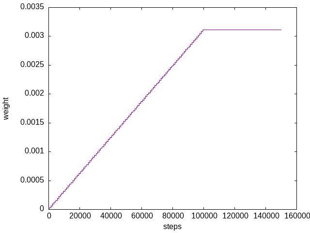

# ICO learning


[Porr, B. and Wörgötter, F. (2003) Strongly Improved Stability and Faster Convergence of Temporal Sequence Learning by Using Input Correlations Only](https://direct.mit.edu/neco/article/18/6/1380/7111/Strongly-Improved-Stability-and-Faster-Convergence)

ICO learning is a learning algorithm which is inspired by spike timing
dependent plasticity. It does "reflex avoidance": It replaces
a slow feedback loop by a faster proactive action.


## What do I need?
  - gcc/g++
  - cmake
  - gnuplot


## Installation
This installs `libicolearning` and the header files
in the default install directories:
```
cmake .
make
sudo make install
```


## Demo
To get a feeling what ICO learning does there is a demo
application. Type:

```
./demo
gnuplot onef_low_weights.plt
evince onef_low_weights.eps
```



Above shown are the weights of ICO learning. Until step 100000
there's a typical STDP timing situation: First the predictive
neuron gets an input and then the reflex neuron gets an input.
The weights grow. Then it is assumed that the output of the
neuron has successfully eliminated the reflex input and therefore
the reflex input is switched off. You see that the weights
stabilise.

Instead of _low_ you can get _high_ and _highest_ if you write
```
./demo -d 1
./demo -d 2
```

Have fun!
