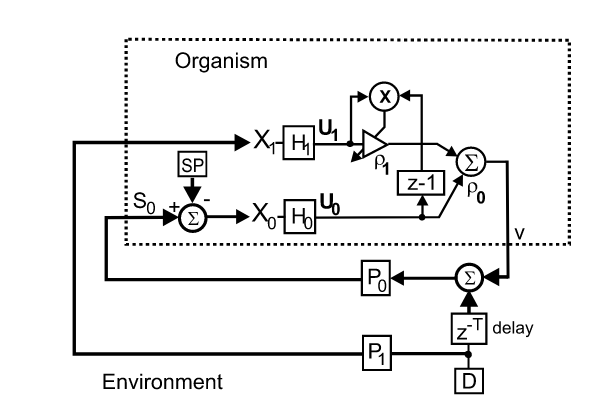
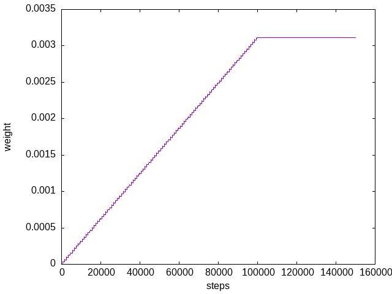
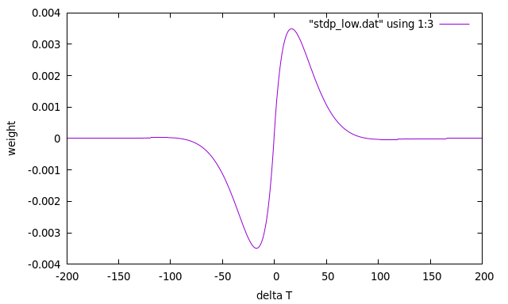
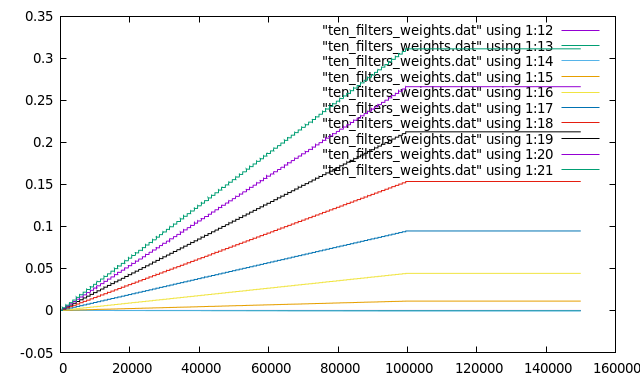

# ICO learning

[](https://zenodo.org/badge/latestdoi/397375628)



[Porr, B. and Wörgötter, F. (2003) Strongly Improved Stability and Faster Convergence of Temporal Sequence Learning by Using Input Correlations Only](https://direct.mit.edu/neco/article/18/6/1380/7111/Strongly-Improved-Stability-and-Faster-Convergence)

ICO learning is a learning algorithm which is inspired by spike timing
dependent plasticity. It does "reflex avoidance": It replaces
a slow feedback loop by a faster proactive action.


## What do I need?
  - gcc/g++
  - cmake
  - gnuplot


## Installation
This installs `libicolearning` and the header files
in the default install directories:
```
cmake .
make
sudo make install
```


## Demo
To get a feeling what ICO learning does there is a demo
application. There are 3 different demo options.

### Single filter and single weight in the predictive path

```
./demo 0
gnuplot onef_weights.plt
```



Above shown are the weights of ICO learning. Until step 100000
there's a typical timing situation: First the predictive
neuron is triggered and then the reflex neuron receives an input signal.
The weights grow. Then it is assumed that the output of the
neuron has successfully eliminated the reflex and therefore
the reflex input stays zero (=error at zero). You see that the weights
stabilise.


### Spike timing dependent plasticity curve

The derivative of the reflex (or error input) correlated with the predictive input produces
an Spike Timing Dependent (STDP) like weight change when the timing between predictive input
and reflex is systematically changed.


```
./demo 1
gnuplot stdp.plt
```



### Filterbank with 10 different filters in the predictive pathway

The filterbank generates different timings so that the predictive pathway can choose
the filter response which is best suited to eliminate the reflex.

```
./demo 10
gnuplot ten_filters_weights.plt
```



Have fun!
